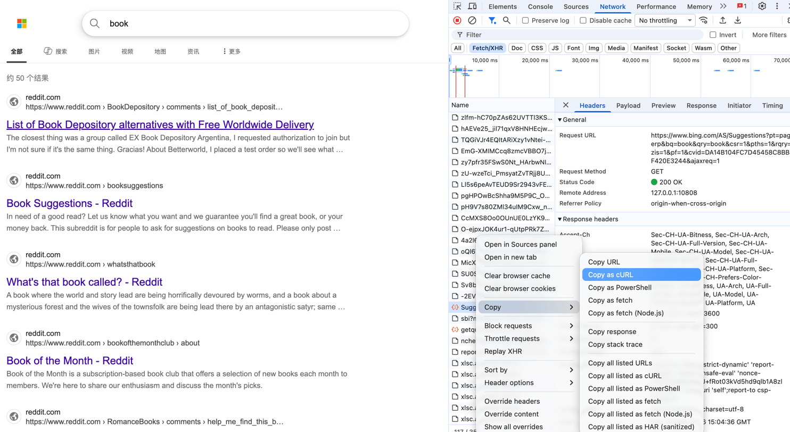
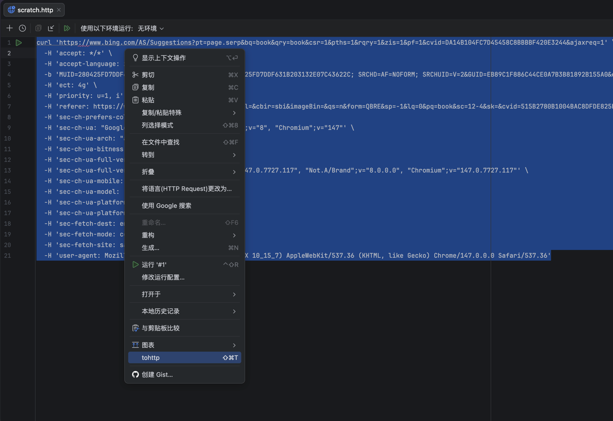
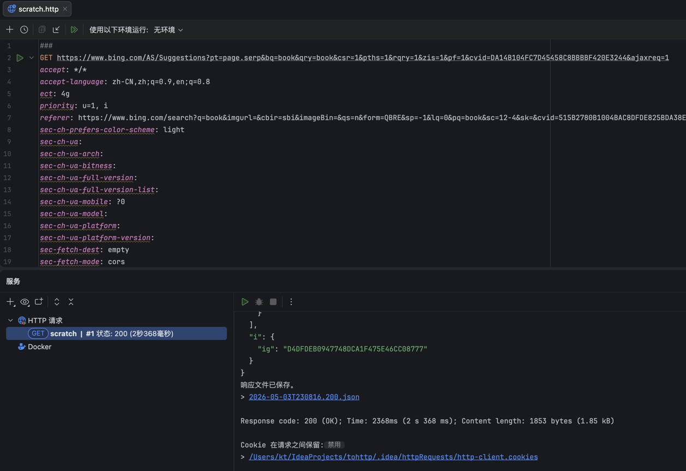

# 使用场景
需要把浏览器的http请求，复制到idea的http文件中重放时使用

# 打包命令
./gradlew buildPlugin

# 使用方法
## 从浏览器的network将http请求复制成curl（bash）格式

## 选中复制的curl代码，右键，点击tohttp

## 转成http插件代码后可直接在idea运行

## 也可以使用快捷键进行转换：选中curl代码按 ctrl+shift+t